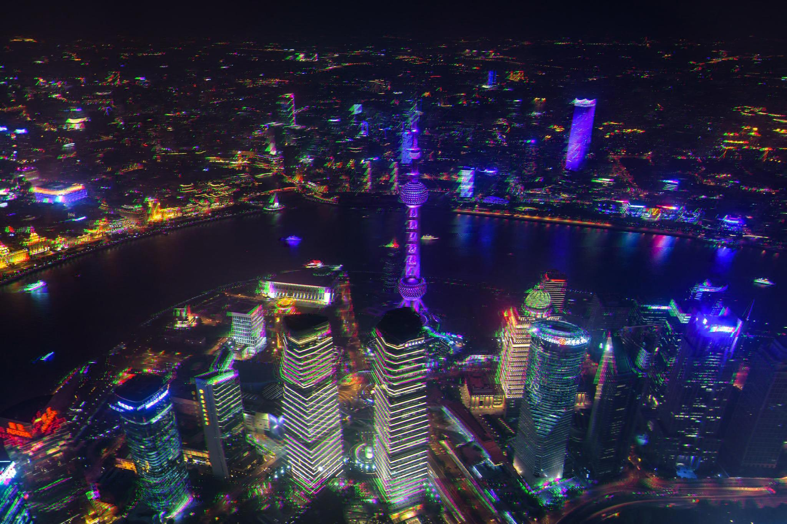

# OldSchoolFilter

A static photo filter website based on React. 

# Demo

Click [here](https://wonderyue.github.io/OldSchoolFilter/) to try it online.


Fliters:

- CRT

  

- VHS

  

- Cyberpunk

  

# How to run

This project  is created with create-react-app.

```shell
npm install
npm run start
```

